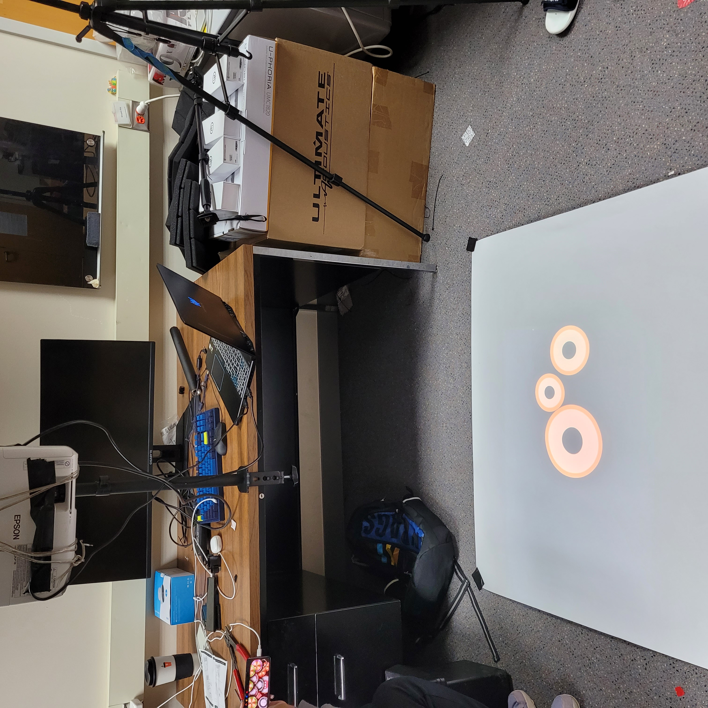

# MuTable: Musical Table
Turn any surface into a musical instrument.

# Hardware
- Projector
- Depth Camera (Intel RealSense)
- 2 Arduino Nano 33 BLE

# Instructions

## Hardware Setup
- Connect Projector and Camera to the laptop/desktop and keep it fixed for the session
 

## Installation Instructions
- Replace the mac addresses of the motion sensing bands with your own bands [Right Band](https://github.com/akash17mittal/muTable/blob/main/src/ble_tap_receiver.py#L113) and [Left Band](https://github.com/akash17mittal/muTable/blob/main/src/ble_tap_receiver.py#L94) here. 
- `pip3 install -r requirements.txt`
- Program the arduino/motion sensing bands using `tapDetection/BLEArduino/BLEArduino.ino`
- Run `python3 src/main.py`
- Wait for about 30 seconds for the system to auto-calibrate and motion sensing bands to get connected to the system

# System Overview and Demo
